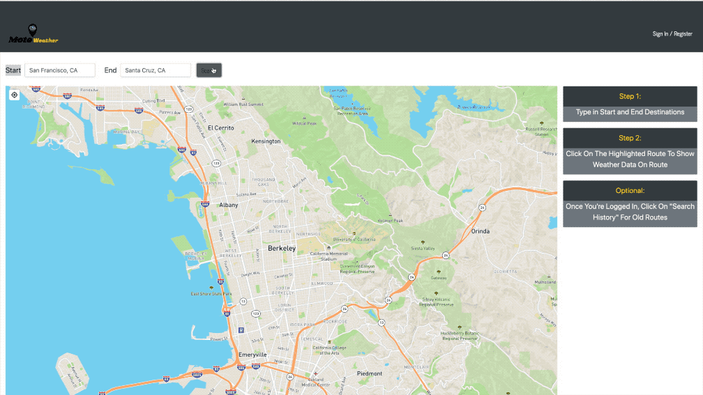

# MotoWeather App

Overview: MotoWeather allow users to input start and end locations of a route and choose specific points in the route to pull weather conditions/forecasts. Users will be able to make searches without logging in, or create an account so that they can save their searches. The app is targeted at motorcycle riders to help with planning for road and weather conditions before their rides.

## Technologies and Implementations Used
* React & React Hooks
* React-Map-GL & Deck.GL
* Axios
* Express 
* HTML/CSS

## API's Used
* OpenWeather
* Mapbox

## Build Instructions

* Clone the repo

* Run `npm i` in the root directory of the app to install dependencies

* Start the app by running `npm start` from the project root.

* Once the server and app start it should open your default browser to [localhost:3000](http://localhost:3000).

## Live App

* Open the heroku app http://moto-weather.herokuapp.com/

* Type in Start and End Destinations

* Click On The Highlighted Route To Show Weather Data On Route

* Once You're Logged In, Click On "Search History" For Old Routes

